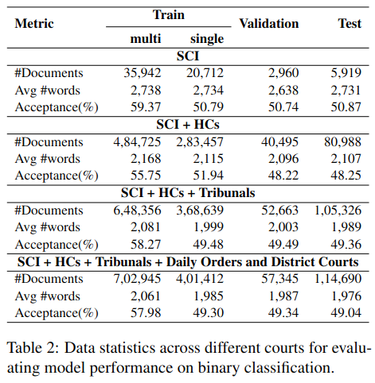
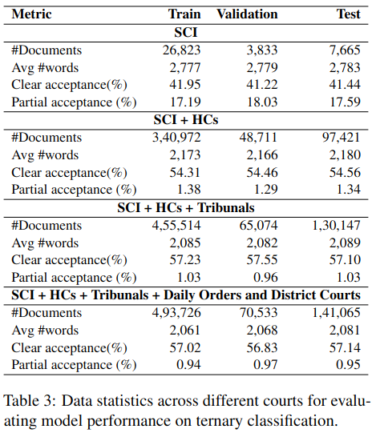
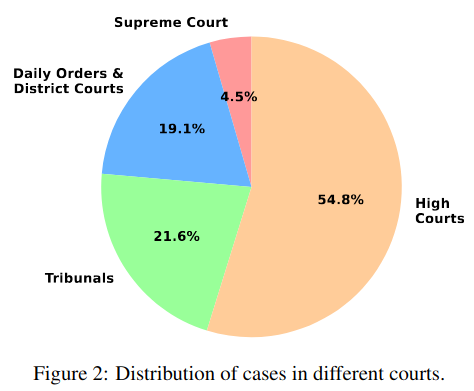

<h1 align="center">

<br>
NyayaAnumana & INLegalLlama: The Largest Indian Legal Judgment Prediction Dataset and Specialized Language Model for Enhanced Decision Analysis (COLING 2025)
</h1>


<p align="center">
  <a href="https://huggingface.co/L-NLProc"><b>[🌐 Website]</b></a> •
  <a href="https://aclanthology.org/2025.coling-main.738/"><b>[📜 Proceedings]</b></a> •
  <a href="https://arxiv.org/abs/2412.08385"><b>[📜 ArXiv]</b></a> •
  <a href="https://huggingface.co/collections/L-NLProc/nyayaanumana-and-inlegalllama-models-6755809db3826df8fd96d570"><b>[🤗 HF Models]</b></a> •
  <a href="https://github.com/ShubhamKumarNigam/NyayaAnumana-and-INLegalLlama/tree/main"><b>[ GitHub]</b></a> •
  <a href="https://forms.gle/81XMsnZpTQBfPeZt7"><b>[📝 Google Form to request dataset access]</b></a> 
</p>

<p align="center">
  This is the official implementation of the paper:
</p>
<p align="center">
  <a href="https://arxiv.org/abs/2412.08385">NyayaAnumana & INLegalLlama: The Largest Indian Legal Judgment Prediction Dataset and Specialized Language Model for Enhanced Decision Analysis</a> (to appear in <strong>[COLING 2025](https://coling2025.org/)</strong>)
</p>
<p align="center">
 <b>Authors:</b> <a href="https://sites.google.com/view/shubhamkumarnigam">Shubham Kumar Nigam</a>, <a href="https://www.linkedin.com/in/balaramamahanthi-deepak-patnaik-b83043246/">Balaramamahanthi Deepak Patnaik</a>, <a href="https://www.linkedin.com/in/shivamm1602/">Shivam Mishra</a>, <a href="#">Noel Shallum</a>, <a href="https://sites.google.com/view/kripabandhughosh-homepage/home">Kripabandhu Ghosh</a>, and <a href="https://www.cse.iitk.ac.in/users/arnabb/">Arnab Bhattacharya</a>:
</p>

## Overview
The integration of artificial intelligence (AI) in legal judgment prediction (LJP) has the potential to transform the legal landscape, particularly in jurisdictions like India, where a significant backlog of cases burdens the legal system. InLegalLlama addresses the inherent challenges of legal outcome prediction and explainability, stemming from the complexity of legal proceedings and the scarcity of expert-annotated data. Our solution, powered by the NyayaAnumana Dataset, offers a comprehensive approach to legal analysis, leveraging over 700,000 meticulously processed cases. Additionally, the model benefits from 15,000 expert-annotated instances sourced from the PredEx dataset, which are critical for improving prediction accuracy and providing clear, understandable explanations. Key highlights of the project include:

1. **NyayaAnumana Database**: A comprehensive legal resource developed using keyword-based analysis and heuristic NLP methods, encompassing over 700,000 carefully processed cases, providing a robust foundation for legal predictions.

2. **Improved Prediction Accuracy**: We enhanced prediction accuracy within the Indian legal domain to over 90%, optimizing transformer-based models on the NyayaAnumana dataset and evaluating performance across diverse courts and hierarchical legal data.

3. **InLegalLlama Generative Model**: An explainable generative Large Language Model (LLM) designed to predict legal outcomes with clear, understandable explanations. InLegalLlama achieved an impressive 76.05% accuracy, outperforming state-of-the-art results from PredEx (51.77%) and the base Llama2 model (57.26%).

This advancement sets a new benchmark for legal judgment prediction in the NLP community, making strides in both accuracy and explainability for legal applications.
If you have any questions on this work, please open a [GitHub issue](https://github.com/ShubhamKumarNigam/NyayaAnumana-and-INLegalLlama/issues) or email the authors at

```shubhamkumarnigam@gmail.com, bdeepakpatnaik2002@gmail.com, shivam1602m@gmail.com```

## NyayaAnumana

This paper introduces _NyayaAnumana_, the largest and most diverse corpus of Indian legal cases compiled for LJP, encompassing a total of 7,02,945 preprocessed cases. _NyayaAnumana_, which combines the words **"Nyay" (judgment)** and **"Anuman" (prediction or inference)** respectively for most major Indian languages, includes a wide range of cases from the Supreme Court, High Courts, Tribunal Courts, District Courts, and Daily Orders and, thus, provides unparalleled diversity and coverage. Our dataset surpasses existing datasets like PredEx and ILDC, offering a comprehensive foundation for advanced AI research in the legal domain. 

### Dataset Compilation
The dataset compilation involved collecting 22,82,137 raw Indian court case proceedings up to April 2024 from the IndianKanoon website, a well-known legal search engine. After preprocessing, a total of 7,02,945 preprocessed cases were finalized for use in the dataset.

### Data Categorization
The dataset is categorized into single and multi based on the target classification task. You can choose the appropriate categorization based on your use case:

1. **Binary Classification Task**: Fine-tuning models to classify cases into one of three categories:
   - Rejected (label-0/class-0): Cases where all judgments, whether single or multiple, are rejected.
   - Accepted (label-1/class-1): Cases where all judgments, whether single or multiple, are accepted.

2. **Ternary Classification Task**: Fine-tuning models to classify cases into one of three categories:
   - Rejected (label-0/class-0): Cases where all judgments, whether single or multiple, are rejected.
   - Accepted (label-1/class-1): Cases where all judgments, whether single or multiple, are accepted.
   - Partially Accepted (label-2/class-2): Cases with multiple judgments, where some are accepted and others are rejected.

Choose the categorization that best suits your usecase.


### Data Statistics
The dataset is categorized into ‘single’ and ‘multi’ decision types, with detailed statistics provided in Tables 2 and 3, including document counts, average token lengths, and decision distributions. The data is also analyzed on a court-wise basis, revealing insights into case characteristics across different court levels.

<table>
  <tr>
    <td></td>
    <td></td>
  </tr>
</table>
The below pie chart shows the distribution of cases in different courts in percentage.This breakdown helps in understanding the diversity within the dataset and the varying complexities associated with different court levels.



## INLegalLlama
In addition to the dataset, we present _INLegalLlama_, a domain-specific generative large language model (LLM) tailored to the intricacies of the Indian legal system.The INLegalLlama integrates Large Language Models (LLMs) with the NyayaAnumana and PREDEX datasets to enhance legal judgment prediction and explanation capabilities. It is developed through a two-phase training approach over a base LLaMa model. First, Indian legal documents are injected using continual pretraining. Second, task-specific supervised finetuning is done. This method allows the model to achieve a deeper understanding of legal contexts.
The two primary phases employed are:
1. Continued PreTraining
2. Supervised FineTuning
<br/>

1. **Continued PreTraining**: We begin by continuing the pretraining of the base LLAMA2 model on a subset of the NyayaAnumana dataset. This phase aims to enrich the model's understanding of legal text and domain-specific knowledge.
2. **Supervised FineTuning**: The model produced from the CPT phase undergoes supervised fine-tuning on the PREDEX dataset. This step is focused on optimizing the model for predicting judgments and providing coherent explanations in downstream tasks.


---

Our experiments demonstrate that incorporating diverse court data significantly boosts model accuracy, achieving approximately 90% F1-score in prediction tasks. _INLegalLlama_ not only improves prediction accuracy but also offers comprehensible explanations, addressing the need for explainability in AI-assisted legal decisions.For a comprehensive overview of the experiments conducted and the corresponding results evaluated across various metrics, please refer to the main paper.

## Getting Started

### General Instructions

Ensure you have the necessary hardware and software requirements in place to replicate our experimental setup. Follow the steps below to configure your environment for optimal performance.

## Recommended Hardware Configuration

### Hardware Specifications

- Utilize two cores of [NVIDIA A100-PCIE-40GB](https://www.nvidia.com/en-gb/data-center/a100/) with 126GB RAM of 32 cores for instruction fine-tuning.
- Additionally, a Google Colab Pro subscription with A100 Hardware accelerator is recommended for conducting Continued Pre-training,inference and other experiments.

## Recommended Software Configuration

### Software Setup

- Set up the environment with appropriate drivers and libraries for GPU acceleration.
- Install necessary dependencies for model training and inference.

## Model Training Specifics

### Fine-tuning Parameters

- Fine-tune the Large Language Models (LLMs) for 5 epochs using Parameter-Efficient Fine-Tuning to strike a balance between optimal training and avoiding overfitting, while incorporating Early Stopping during instruction fine-tuning.
  
### Post-processing for Quality Enhancement

- Implement a post-processing step after inference to address common issues in generative models, such as sentence hallucination and repetition.
- Filter out repeated decision and explanation parts by selecting only the initial occurrences, ensuring concise and coherent outputs.
- Use effective prompt engineering during inference, instructing the model to first provide the judgment label followed by the corresponding explanation, facilitating easier label extraction during post-processing.


## Citation
If you use this project in your research or other work, please cite it as follows:
```
@article{nigam2024nyayaanumana,
  title={NyayaAnumana \& INLegalLlama: The Largest Indian Legal Judgment Prediction Dataset and Specialized Language Model for Enhanced Decision Analysis},
  author={Nigam, Shubham Kumar and Patnaik, Balaramamahanthi Deepak and Mishra, Shivam and Shallum, Noel and Ghosh, Kripabandhu and Bhattacharya, Arnab},
  journal={arXiv preprint arXiv:2412.08385},
  year={2024}
}

