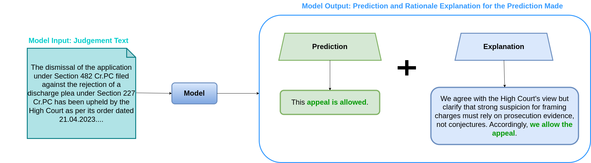
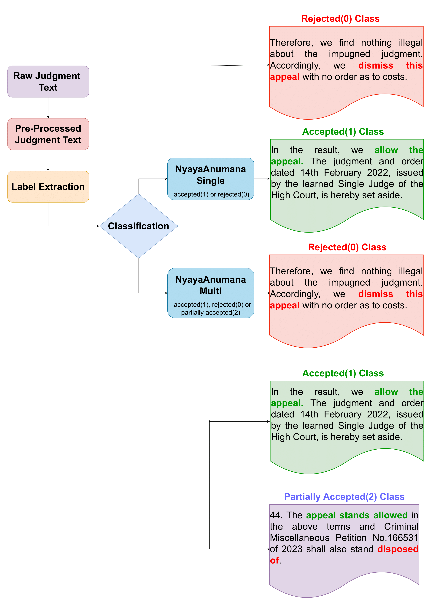
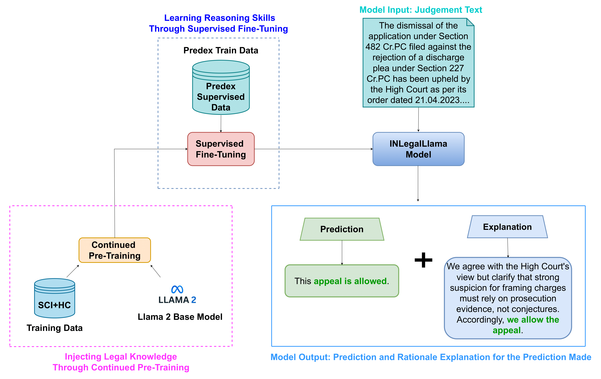

<h1 align="center">

<br>
NyayaAnumana & INLegalLlama: The Largest Indian Legal Judgment Prediction Dataset and Specialized Language Model for Enhanced Decision Analysis (COLING 2025)
</h1>



<p align="center">
  <a href="https://huggingface.co/L-NLProc"><b>[🌐 Website]</b></a> •
  <a href="#"><b>[📜 Proceedings]</b></a> •
  <a href="https://arxiv.org/abs/2412.08385"><b>[📜 ArXiv]</b></a> •
  <a href="https://huggingface.co/collections/L-NLProc/nyayaanumana-and-inlegalllama-models-6755809db3826df8fd96d570"><b>[🤗 HF Models]</b></a> •
  <a href="https://forms.gle/81XMsnZpTQBfPeZt7"><b>[📝 Google Form to request dataset access]</b></a> •
  <a href="https://github.com/ShubhamKumarNigam/NyayaAnumana-and-INLegalLlama/tree/main"><b>[🐱 GitHub]</b></a>
</p>

<p align="center">
  This is the official implementation of the paper:
</p>
<p align="center">
  <a href="https://arxiv.org/abs/2412.08385">NyayaAnumana & INLegalLlama: The Largest Indian Legal Judgment Prediction Dataset and Specialized Language Model for Enhanced Decision Analysis</a> (to appear in <strong>COLING 2025</strong>)
</p>
<p align="center">
 <b>Authors:</b> <a href="https://sites.google.com/view/shubhamkumarnigam">Shubham Kumar Nigam</a>, <a href="https://www.linkedin.com/in/balaramamahanthi-deepak-patnaik-b83043246/">Balaramamahanthi Deepak Patnaik</a>, <a href="https://www.linkedin.com/in/shivamm1602/">Shivam Mishra</a>, <a href="#">Noel Shallum</a>, <a href="https://sites.google.com/view/kripabandhughosh-homepage/home">Kripabandhu Ghosh</a>, and <a href="https://www.cse.iitk.ac.in/users/arnabb/">Arnab Bhattacharya</a>:
</p>

---

## Overview

The integration of artificial intelligence (AI) in legal judgment prediction (LJP) has the potential to transform the legal landscape, particularly in jurisdictions like India, where a significant backlog of cases burdens the legal system. This paper introduces _NyayaAnumana_, the largest and most diverse corpus of Indian legal cases compiled for LJP, encompassing a total of 7,02,945 preprocessed cases. _NyayaAnumana_, which combines the words **"Nyay" (judgment)** and **"Anuman" (prediction or inference)** respectively for most major Indian languages, includes a wide range of cases from the Supreme Court, High Courts, Tribunal Courts, District Courts, and Daily Orders and, thus, provides unparalleled diversity and coverage. Our dataset surpasses existing datasets like PredEx and ILDC, offering a comprehensive foundation for advanced AI research in the legal domain. 

In addition to the dataset, we present _INLegalLlama_, a domain-specific generative large language model (LLM) tailored to the intricacies of the Indian legal system. It is developed through a two-phase training approach over a base LLaMa model. First, Indian legal documents are injected using continual pretraining. Second, task-specific supervised finetuning is done. This method allows the model to achieve a deeper understanding of legal contexts. 

Our experiments demonstrate that incorporating diverse court data significantly boosts model accuracy, achieving approximately 90% F1-score in prediction tasks. _INLegalLlama_ not only improves prediction accuracy but also offers comprehensible explanations, addressing the need for explainability in AI-assisted legal decisions.

---



# INLegalLlama
The INLegalLlama integrates Large Language Models (LLMs) with the NyayaAnumana and PREDEX datasets to enhance legal judgment prediction and explanation capabilities. 
This encompasses two main phases for working with LLMs:
1. Continued PreTraining
2. Supervised FineTuning
<br/>

1. **Continued PreTraining**: We begin by continuing the pretraining of the base LLAMA2 model on a subset of the NyayaAnumana dataset. This phase aims to enrich the model's understanding of legal text and domain-specific knowledge.
2. **Supervised FineTuning**: The model produced from the CPT phase undergoes supervised fine-tuning on the PREDEX dataset. This step is focused on optimizing the model for predicting judgments and providing coherent explanations in downstream tasks.




## Citation
If you use this project in your research or other work, please cite it as follows:
```
@article{nigam2024nyayaanumana,
  title={NyayaAnumana \& INLegalLlama: The Largest Indian Legal Judgment Prediction Dataset and Specialized Language Model for Enhanced Decision Analysis},
  author={Nigam, Shubham Kumar and Patnaik, Balaramamahanthi Deepak and Mishra, Shivam and Shallum, Noel and Ghosh, Kripabandhu and Bhattacharya, Arnab},
  journal={arXiv preprint arXiv:2412.08385},
  year={2024}
}

